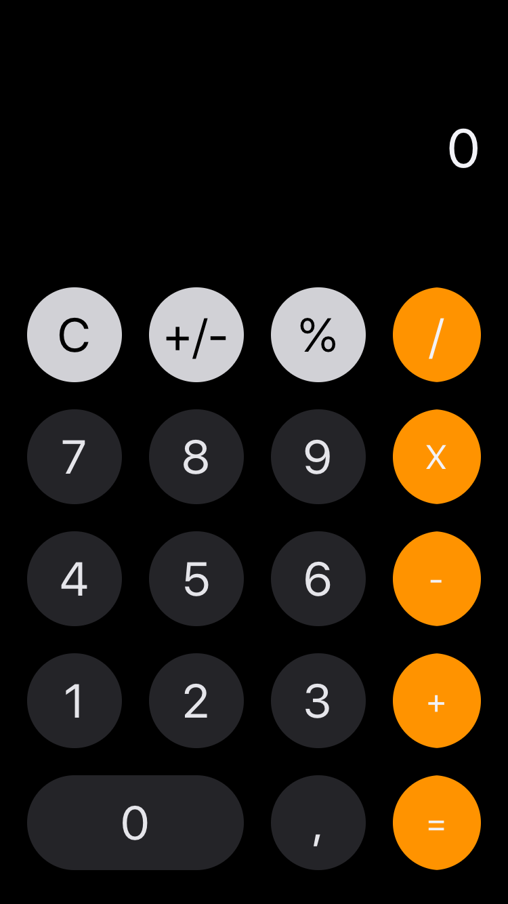

# DOJO - Digital House Mobile iOS
Desenvolver uma calculadora em iOS seguindo os requisitos abaixo.

### Requisitos de ​Layout
Composição da tela
- 10 botões numéricos (0, 1, 2, 3, 4, 5, 6, 7, 8, 9);
- 5 botões de ​ação ​(/, +, -, * e =) ;
- 1 campo de texto.
- Os botões precisam ter fundo colorido;
- Como desafio extra, deixar o botão arredondado;

### Requisitos de Funcionalidades
- Sempre que um botão ​numérico for pressionado, o seu respectivo número deve aparecer no campo de texto;
- Os valores inseridos pelo usuário devem ser armazenados para os cálculos;
- Sempre que um botão de ​cálculo ​(/, +, -, *) for pressionado, ele deve chamar uma ​função​ que execute sua respectiva funcionalidade;
- O resultado só deve aparecer na tela depois que o usuário clicar no botão de igual (​=​).

### Print 
